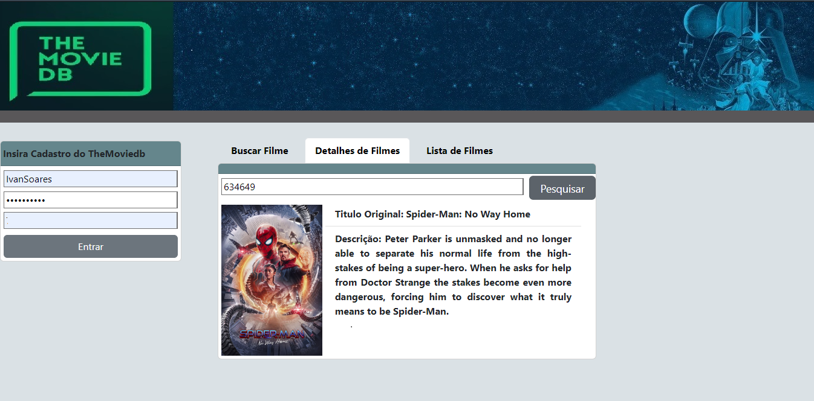

# Aula de Typescript da Take na plataforma DIO
O projeto consiste de 4 desafios relacionados a prática do uso de Typescript. 
Onde o desafio 4 cria um projeto que consome a base de dados de filme do TMDB para criar um organizador de filmes. A aparência final esta representado da imagem:

A ideia dessa atividade é criar um aplicativo que: 
    * Busca filmes*
    * Apresenta uma lista com os resultados pesquisados*
    * Permite a criação de listas de filmes e a posterior adição de filmes nelas*
    
## Sobre a estrutura de commits  
Os commits foram feitos de tal forma que o usuário pode ler commit a commit em ordem de publicação e acompanhar gradualmente a criação do repositório e a lógica aplicada. É recomendado que o primeiro estudo seja feito dessa forma. Pequenos erros nos comentários ou de gramática podem ser encontrados no caminho (consequências do programador que estuda de madrugada), mas eles já foram devidamente corrigidos na última versão da main.

## Estrutura do repositório 
* *src* 
* *desafios*
    * Contém vários arquivos JS que podem ser refatorados para solidificar o conhecimento adquirido na aula
* *index.html*
    * É onde está a chamada para o arquivo app.js e pode ser manipulado a vontade para testarem seus scripts
* *tsconfig.json*
    * O coração do TS que configura suas funcionalidades.  
* *package.json*
    * Nesse arquivo foram colocados alguns scripts com o propósito de facilitar a vida de quem usar esse repositório
        * start
            * Inicia o *lite-server*, que vai escutar modificações no index.html e em seus arquivos importados. É útil caso queira fazer testes no browser. A porta disposta normalmente é a *localhost:3000*
        * watch  
            * Roda o *tsc --watch* com o propósito de compilar constantemente qualquer coisa que for editada nos arquivos TS para sua contraparte em JS. Esse comando evita que *tsc* tenha que ser digitado constantemente para fazer a compilação.  

## Sobre como testar 
* Teste mão livre
    * Faça suas alterações em src/app.ts
    * Rode *tsc* ou *npm watch* para compilar elas para o arquivo dist/app.js
    * Caso queira fazer um teste interagindo com o DOM, altere o index.html
    * Rode o npm start e acesse o localhost:3000
* Testar algum dos arquivos da pasta de exemplos ou desafios
    * Copie e cole o conteúdo para o arquivo src/app.ts ou altere o caminho do atributo src da tag script no index.html  
        * ex : *src=dist/app.js* -> *src=dist/exemplos/any.js*
    * Rode *tsc* ou *npm watch* para compilar elas para o arquivo dist/app.js
    * Caso queira fazer um teste interagindo com o DOM, altere o index.html
    * Rode o npm start e acesse o localhost:3000 
Caso queira fazer testes usando html é só alterar o index.html.

## Sobre o tsconfig.json  
* Algumas configurações e funcionalidades legais são:
    1. Opções básicas:
        * target
            * Define para qual versão do ECMAScript o typescript vai ser convertido
        * lib
            * Define quais bibliotecas vão vir por default com o TS. Isso é bacana caso o TS esteja sendo usado no backend e a iteração com o DOM não é necessária. Como teste, tentem remover as bibliotecas do DOM e olhem seu código enchendo de erros porque não sabe o que é um document
        * sourceMap
            * Cria arquivos .map.js que geram uma cópia do seu arquivo TS no source do browser (aquele do inspect). Podem ser debugados via breakpoint direto no browser e são uma excelente ajuda, já que o código compilado de JS é menos legível que o TS.
        * outDir
            * Pasta para onde seus arquivos JS serão enviados
        * rootDir
            * Pasta de onde seus arquivos TS serão coletados. Pode ser necessário inserir a opção include fora do *compilerOptions* com a pasta *src* inclusa
    2. Opções de checagem de tipo:
        * strict
            * Marca todas opções de checagem de tipo como verdadeiras. Ideal caso seja a intenção do usuário ter o código mais consistente possível
        * noImplicitAny
            * Levanta erro caso variáveis não estejam tipadas. Caso essa seja a intenção, um "any" tem que ser explicitamente tipado
        * strictNullChecks
            * Pode levantar erro caso uma variável em uso seja potencialmente nula. 
                * Ex: um botão que foi buscado usando um getElementById que não necessariamente vai encontrar um elemento é usado para escutar um evento.
    3. Outras opções
        * noUnusedLocals
            * Levanta erro sempre que uma variável local não está sendo utilizada, como um let dentro de uma função
        * nuUnusedParameters
            * Mesmo caso de noUnusedLocals, mas para parâmetros de função
        * noImplicitReturns
            * Levanta um erro caso uma função tenha caminhos que retornam valor e outros que não retornam
    4. Existem outras regras e explicações mais elaboradas na documentação oficial (https://www.typescriptlang.org/tsconfig)
   
## Sobre colaboração 
Sinta-se livre para abrir pull requests com melhorias para ajudar quem quiser aprender mais sobre Typescript. Também podem tirar dúvidas comigo via comentário.
